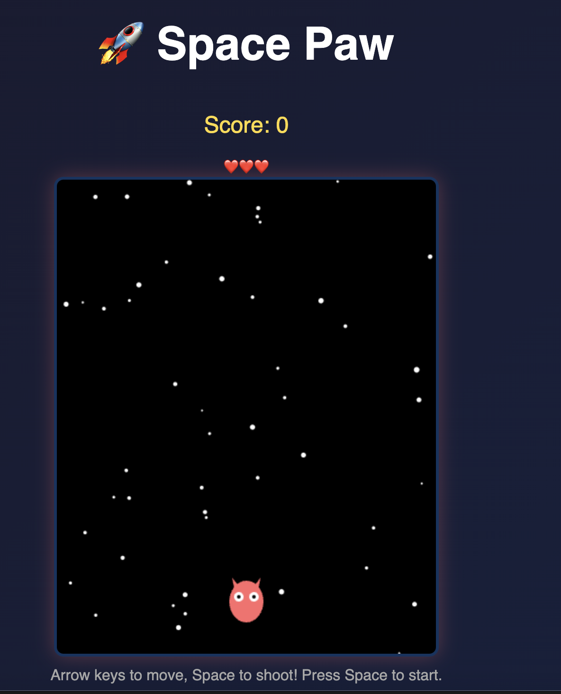

<div align="center">

# Space Paw Shooter

[](https://developer.mozilla.org/en-US/docs/Web/HTML)
[](https://developer.mozilla.org/en-US/docs/Web/JavaScript)
[](https://pages.github.com)
[](LICENSE)

**A top-down space shooter game built with HTML5 Canvas**

[Live Demo](https://alfredang.github.io/space-paw-shooter) · [Report Bug](https://github.com/alfredang/space-paw-shooter/issues) · [Request Feature](https://github.com/alfredang/space-paw-shooter/issues)

</div>

## Screenshot



## About

Space Paw Shooter is a fun arcade-style space shooter game where you pilot a cat-shaped spaceship through a cosmic battlefield. Destroy alien invaders, survive as long as you can, and aim for the high score!

### Key Features

- 🐾 Cute cat-shaped player ship with ears and eyes
- 👾 Green alien enemies with animated movements
- ⭐ Scrolling starfield background
- 🔫 Laser shooting with sound effects (Web Audio API)
- 💥 Explosion sounds when hitting enemies
- ❤️ 3-life survival system
- 🎮 Progressive difficulty with random enemy spawning
- 🚀 Built entirely with HTML5 Canvas and vanilla JavaScript

## Tech Stack

| Category | Technology |
|----------|------------|
| Frontend | HTML5, CSS3, JavaScript |
| Graphics | HTML5 Canvas API |
| Audio | Web Audio API |
| Deployment | GitHub Pages |
| Workflow | GitHub Actions |

## Architecture

```
┌─────────────────────────────────────────┐
│              Game Canvas                 │
│  ┌─────────────────────────────────┐   │
│  │     Player Ship (Cat)           │   │
│  │     • Movement (Arrow Keys)     │   │
│  │     • Shooting (Space)           │   │
│  └─────────────────────────────────┘   │
│                                          │
│  ┌─────────────────────────────────┐   │
│  │     Enemies (Aliens)            │   │
│  │     • Random spawning            │   │
│  │     • Collision detection       │   │
│  └─────────────────────────────────┘   │
│                                          │
│  ┌─────────────────────────────────┐   │
│  │     Audio System                 │   │
│  │     • Shoot sound               │   │
│  │     • Hit sound                │   │
│  │     • Game over sound           │   │
│  └─────────────────────────────────┘   │
└─────────────────────────────────────────┘
```

## Project Structure

```
space-paw-shooter/
├── index.html          # Main game HTML structure
├── game.js            # Game logic, rendering, collision detection
├── style.css          # Game styling and animations
├── README.md          # This file
├── screenshot.png     # Game screenshot
└── .github/
    └── workflows/
        └── deploy.yml  # GitHub Actions deployment
```

## Getting Started

### Prerequisites

- A modern web browser (Chrome, Firefox, Safari, Edge)
- Git installed on your machine

### Installation

1. Clone the repository:
```bash
git clone https://github.com/alfredang/space-paw-shooter.git
cd space-paw-shooter
```

2. Open `index.html` in your browser:
```bash
# On macOS
open index.html

# On Linux
xdg-open index.html

# On Windows
start index.html
```

Or simply double-click the `index.html` file.

### Running a Local Server

For the best experience, run a local server:
```bash
# Using Python
python -m http.server 8000

# Using Node.js
npx serve .
```

Then open http://localhost:8000 in your browser.

## How to Play

1. Press **Space** to start the game
2. Use **Arrow Keys** to move your ship
3. Press **Space** to shoot lasers
4. Destroy aliens to earn points (+100 each)
5. Avoid collisions with aliens
6. Game over when all 3 lives are lost

## Controls

| Action | Input |
|--------|-------|
| Start Game | Space |
| Move Ship | Arrow Keys (Up/Down/Left/Right) |
| Shoot | Space |
| Restart | Space (after game over) |

## Deployment

The game is automatically deployed to GitHub Pages using GitHub Actions.

To deploy manually:
1. Push changes to the `main` branch
2. GitHub Actions will automatically build and deploy
3. Visit https://alfredang.github.io/space-paw-shooter

## Contributing

1. Fork the repository
2. Create your feature branch (`git checkout -b feature/amazing-feature`)
3. Commit your changes (`git commit -m 'Add amazing feature'`)
4. Push to the branch (`git push origin feature/amazing-feature`)
5. Open a Pull Request

## License

This project is licensed under the MIT License - see the [LICENSE](LICENSE) file for details.

---

<div align="center">

Made with ❤️ by [Alfred Ang](https://github.com/alfredang)

</div>
